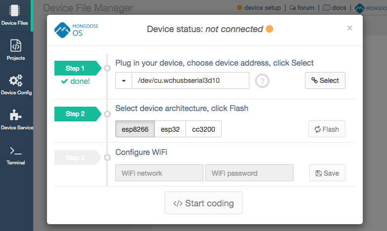

# Instrucciones para instalar mongoose-os
## macOS
#### Instalar los driver de la placa para macOS.
* Desinstalar los controladores antiguos, use algunos de los sigiuentes comandos(dependiendo de su instalación):
  * `sudo rm -rf /System/Library/Extensions/usb.kext`
  * `sudo rm -rf /Library/Extensions/usbserial.kext`
*  Reinicie su Mac
*  Doble click en `CH34x_Install_V1.3.pkg`.
*  Reinicie su Mac
*  Plug in your device. It should now be listed under the `/dev` directory. Examples:
*  Conecte el dispositivo. Deberia aparecer listado bajo la ruta `/dev`. Ejemplos:
  * `/dev/cu.wchusbserial1410`
  * `/dev/cu.wchusbserial1420`

#### Instalación bajo Homebrew-Cask

* Instale los controladores con los siguientes comandos:
  * `brew tap mengbo/ch340g-ch34g-ch34x-mac-os-x-driver https://github.com/mengbo/ch340g-ch34g-ch34x-mac-os-x-driver`
  * `brew cask install wch-ch34x-usb-serial-driver`
* Reinicie su Mac

#### Instalación de Mongoose OS en su computador

  Abra su terminal favorita y pegue la siguiente instrucción:

  curl -fsSL https://mongoose-os.com/downloads/mos/install.sh | /bin/bash
  This will download and install the mos tool into ~/.mos/bin/ directory.
  Choose installation type:

  For simple Mongoose OS installation start terminal and enter:
  Para la instalación de Mongoose OS básica:
  ~/.mos/bin/mos

Para flashear su nodemcu, siga las instrucciones de la interfaz web, desplegada en
`http://127.0.0.1:1992/#files`
Ejemplo:

